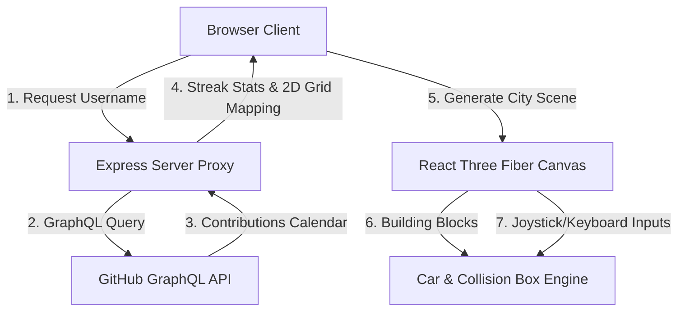

# 🌆 GitHub City

A stunning, full-stack 3D procedural city builder powered by your real GitHub contribution calendar. Turn your coding history into a glowing cyberpunk skyline, drive through the avenues of your commits, toggle environmental settings, and capture your creations.


---

## 🌟 Key Features

### 🏙️ Procedural City Generation
- Mappings of **371 days** (53 weeks × 7 days) of contribution history into a detailed 3D grid layout centered at `[0, 0, 0]`.
- Symmetric blocks split by a central main Avenue and running North-South streets.
- **Dynamic Building Classes** scaling height and colors based on commit counts:
  *   **Empty Lot (0 commits)**: Slate-800 pad.
  *   **Small Building (1-3 commits)**: Emerald-500 tower with randomized height variations.
  *   **Medium Building (4-8 commits)**: Blue-500 office building with procedural rooftop HVAC detailing.
  *   **Skyscraper (9-15 commits)**: Violet-500 high-rise decorated with vertical cyan neon facade strips.
  *   **Mega Tower (15+ commits)**: Pink-500 landmark with set-back tiers, a tall antenna spire, and flashing red warning beacons.

### 🚗 Kinematic Vehicle Simulation
- Drive a low-poly sports car through the streets of your achievements.
- Physics engine tracking velocity, acceleration, sliding friction, and hard braking.
- Wheel kinematics showing axle rolling and steering yaw pivots.
- **AABB sliding collisions** against all active building bounds so the car glides smoothly along walls instead of sticking.
- **Invisible Platform Boundaries**: A safety limit of `76.0` units (4.0 units inside the 160x160 platform edges) keeps the car securely on the map with custom impact damping and sliding bounds.

### 🕹️ Mobile-First Touch Controls
- Context-aware UI detecting mobile devices and tablets (touch-enabled with screens `≤ 1024px`).
- **Virtual Joystick overlay**: Placed at the bottom left using Drei's absolute `<Html>` portal for smooth steering and acceleration.
- **Brake pedal**: A quick-response handbrake button on the bottom right.
- `touchAction: "none"` configured to block standard browser swipe gestures from interfering with vehicle control.
- Hides the Building Class Scale panel on screens `< 768px` automatically to prevent overlapping layout clutter.

### ☀️ Atmospheric & Time Cycles
- **Day/Night Toggle**: Transition between a bright sunset afternoon and a dark neon twilight city.
- **Skybox & Shaders**: A custom `SkyGradient` sphere running a 3-stop vertical gradient shader that blends smoothly over time.
- **Drifting Clouds**: Styled low-poly cloud clusters casting shadows on the streets and fading out automatically during the night.
- **Twinkling Starfield**: 600 particles twinkled dynamically in Night Mode, restricted to the upper hemisphere with depth write disabled.
- **Window night glow**: Windows generated programmatically on canvas textures that glow warm amber at night and turn reflective during the day.

### 📸 Showcase Features
- **Cinematic Drone Camera**: Disables controls and flies through 3 distinct paths: *Avenue Glide*, *Orbit Overview*, and *Skyline Sweep*.
- **WebGL screenshot capture**: Preserves WebGL drawing buffers to let you download clean high-res PNG snapshots (`github-city-username-timestamp.png`) excluding all HTML HUD interfaces.
- **Audio manager**: A persistent singleton looping background music loop with localStorage mute states.

---

## 🏗️ Architecture Blueprint

<details>
<summary><b>Click to expand fullstack data flow</b></summary>



</details>

---

## 🎛️ Controls & Navigation

| Mode | Input / Action | Result |
| :--- | :--- | :--- |
| **Driving** | `W` / `Arrow Up` | Accelerate Forward |
| **Driving** | `S` / `Arrow Down` | Reverse / Decelerate |
| **Driving** | `A` / `Arrow Left` | Steer Left |
| **Driving** | `D` / `Arrow Right` | Steer Right |
| **Driving** | `Spacebar` | Hard Handbrake |
| **Driving** | Mouse Drag | Adjust Camera Angle |
| **Driving** | Scroll Wheel | Adjust Camera Distance |
| **Mobile** | Virtual Left Joystick | Steer & Accelerate |
| **Mobile** | Virtual Right Button | Activate Handbrake |
| **Free Cam** | Left-Click + Drag | Orbit / Rotate Camera |
| **Free Cam** | Right-Click + Drag | Pan Scene |
| **Free Cam** | Scroll Wheel | Zoom In / Out |

---

## 🚀 Setup & Installation

### Prerequisites
- Node.js (v18+)
- A GitHub Personal Access Token (PAT) for GraphQL queries

### 1. Clone the repository
```bash
git clone https://github.com/ranjeet22/github-city.git
cd github-city
```

### 2. Configure Environment Variables
Create a `.env` file in the root directory:
```env
GITHUB_TOKEN=your_github_personal_access_token_here
```
> [!IMPORTANT]
> Keep your `.env` private and never commit it. The proxy server is configured to keep this token safe on the server side and never expose it to client-side assets.

### 3. Install Dependencies
```bash
npm install
```

### 4. Running the Development Suite
Run both the Vite client-side server (port `5173`) and the Express proxy backend (port `3001`) simultaneously:
```bash
npm run dev
```

### 5. Production Compiling & Building
Build the client bundle and launch the production server:
```bash
npm run build
npm start
```

---

## 📂 Source Code Directory

*   [server.js](file:///c:/Users/lenovo/Desktop/Github%20City/server.js) — Secure Node/Express backend proxy with in-memory caching.
*   [dev.js](file:///c:/Users/lenovo/Desktop/Github%20City/dev.js) — Dev runner starting both Express and Vite simultaneously.
*   [src/game/Car.tsx](file:///c:/Users/lenovo/Desktop/Github%20City/src/game/Car.tsx) — Car physics, sliding collisions, boundary clamp, camera follow, and touch joystick.
*   [src/game/CityScene.tsx](file:///c:/Users/lenovo/Desktop/Github%20City/src/game/CityScene.tsx) — Main R3F Canvas rendering roads, streetlights, custom shader gradient, and HUD toggles.
*   [src/services/github.ts](file:///c:/Users/lenovo/Desktop/Github%20City/src/services/github.ts) — Client-side service calling the proxy endpoint.
*   [src/services/audio.ts](file:///c:/Users/lenovo/Desktop/Github%20City/src/services/audio.ts) — Background music singleton.
